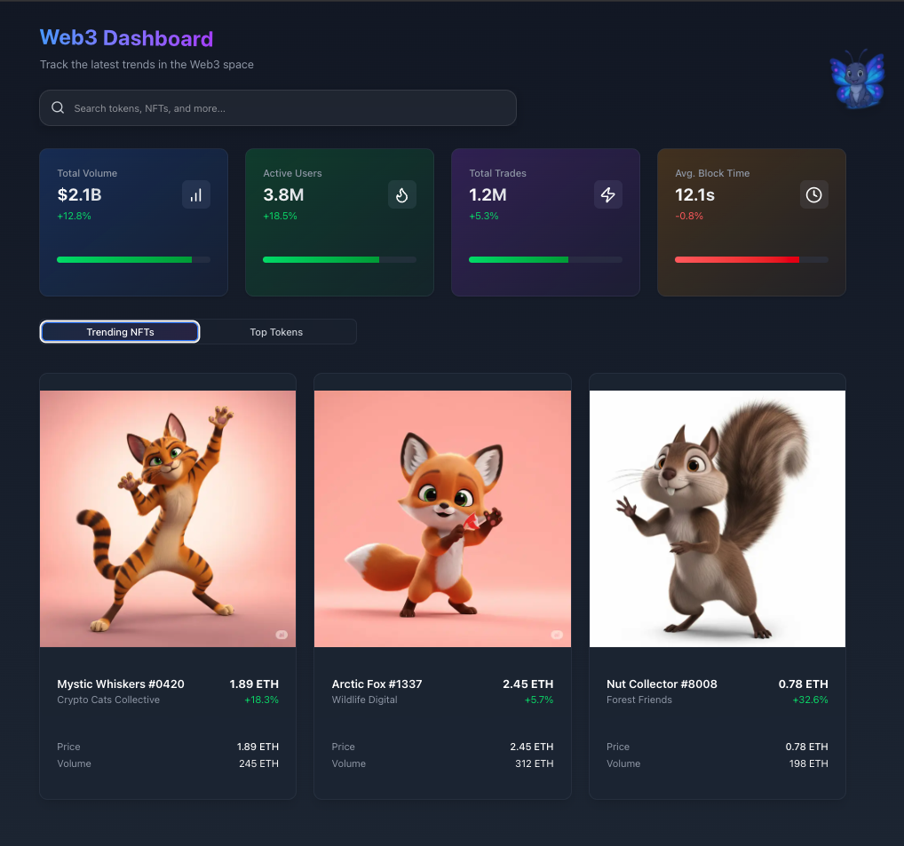
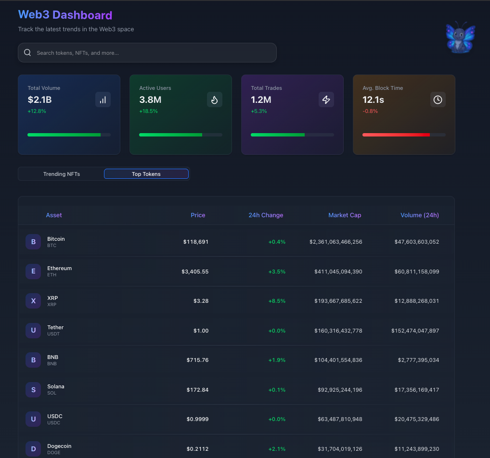
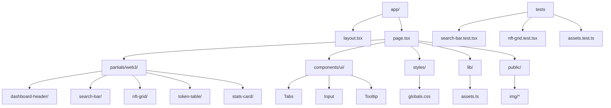

# Web3 Dashboard

[](https://github.com/ChainsQueenEth/web3dashboard/actions/workflows/ci.yml)

A modern, responsive Web3 dashboard interface focused on usability and visual clarity for blockchain and cryptocurrency contexts. It showcases a search-led homepage with KPI cards, an NFT grid, and a token table, built with a Tailwind utility system and animated micro‑interactions.





## 🎨 Design Highlights

### Visual Design
- **Dark theme** surfaces with soft gradients and depth
- **Responsive layout** across breakpoints
- **Micro‑interactions** and smooth animations
- **Custom UI components** with consistent styling

### Technical Implementation
- **Next.js 15 (App Router)**
- **React 19** + **TypeScript 5**
- **Tailwind CSS 4** with global utility classes in `src/styles/globals.css`
- **Framer Motion 12** for animations
- **Radix UI** primitives (Tabs, Tooltip)

## ✨ Key Features

- **Search bar** with glass/gradient halo and focus ring
- **KPI/Stats cards** with animated progress and icons
- **NFT grid** with images, names, collections, and prices
- **Token table** with symbols, prices, and change
- **Tabs** to switch between “Trending NFTs” and “Top Tokens”
- **Animated butterfly** decoration
- **Accessible** UI patterns and keyboard‑focus styles

## 🛠️ Technical Stack

- **Framework**: Next.js 13+ with App Router
- **Styling**: Tailwind CSS
- **Animations**: Framer Motion
- **State Management**: React Context
- **Type Safety**: TypeScript
- **Icons**: Lucide Icons
- **Font**: Geist (optimized with next/font)

## 🧭 Project Structure (Flowchart)

```text
web3dashboard/
├─ app/                          # Next.js App Router entry
│  ├─ page.tsx                   # Home (dashboard)
│  └─ layout.tsx                 # Root layout (imports styles)
│
├─ src/
│  ├─ styles/
│  │  └─ globals.css             # Tailwind + global utility classes (u-*)
│  ├─ components/
│  │  └─ ui/                     # Reusable UI primitives (Tabs, Input, etc.)
│  ├─ partials/                  # Feature-oriented UI blocks
│  │  └─ web3/
│  │     ├─ search-bar/
│  │     │  ├─ search-bar.tsx    # SearchBar component
│  │     │  └─ search-bar.test.tsx
│  │     ├─ dashboard-header/
│  │     │  └─ dashboard-header.tsx
│  │     ├─ nft-grid/
│  │     │  ├─ nft-grid.tsx      # NFT cards grid
│  │     │  └─ nft-grid.test.tsx
│  │     ├─ token-table/
│  │     │  └─ token-table.tsx   # Token list table
│  │     └─ stats-card/
│  │        └─ stats-card.tsx    # KPI/stat cards
│  ├─ lib/
│  │  ├─ assets.ts               # Base-path aware asset helper
│  │  └─ assets.test.ts          # Tests for asset() helper
│  └─ ...
│
├─ public/                       # Static assets (images, icons)
├─ vitest.config.ts              # Vitest + jsdom config
├─ vitest.setup.ts               # Testing Library setup (jest-dom)
└─ README.md
```

## 🧑‍💻 Development Notes

* **Abstraction goal**: Reduce repeated Tailwind strings and keep visuals consistent across components.
* **Where utilities live**: `src/styles/globals.css` defines `u-*` classes consumed by components.
* **When to use utilities**:
  - Use `u-card-soft` / `u-card-soft-strong` for panel surfaces (cards, lists, containers).
  - Use `u-glass-2xl` when an element needs a glass surface (e.g., inputs) rather than the whole container.
  - Use `u-absolute-gradient-overlay` + `u-hover-shadow-blue` for gradient halos and stronger hover depth (e.g., SearchBar wrapper).
  - Use `u-focus-ring-blue` for consistent focus visuals on inputs and interactive elements.
  - Use `u-gradient-text-primary` for primary headings requiring gradient text.
  - Use `u-blur-border` or `u-blur-sm` to add blur with or without borders in small UI affordances.
* **Do not**: Nest custom utilities inside `@apply` rules within other custom utilities; Tailwind disallows that. Compose them in markup.
* **Naming convention**: Prefer `u-*` for global utilities; keep files kebab-case (except Next.js reserved filenames).
* **Testing**: Co-locate tests with components (`*.test.tsx`) to validate rendering and interactions with Testing Library.

### Mermaid Flowchart (Basic Structure)



## 🧪 Testing

Libraries:
- **Vitest**: test runner and assertion library
- **@testing-library/react**: DOM-oriented React testing
- **@testing-library/user-event**: realistic user interactions
- **jsdom**: browser-like environment for unit tests
- **@testing-library/jest-dom**: custom DOM matchers (configured in `vitest.setup.ts`)

What is covered:
- `src/partials/web3/search-bar/search-bar.test.tsx`
  - Renders placeholder
  - Typing updates controlled value
  - Clear button resets the field
- `src/partials/web3/nft-grid/nft-grid.test.tsx`
  - Renders NFT card name, collection and image alt text
  - Shows loading skeletons when `loading` is true
- `src/lib/assets.test.ts`
  - `asset()` prefixes paths with `NEXT_PUBLIC_BASE_PATH` when set
  - Leaves paths unchanged when base path is empty

Run tests:
```bash
pnpm test           # watch mode
pnpm test:ci        # run once
pnpm coverage       # with coverage
```

## 🧰 Global Tailwind Utilities

Common, reusable styles are defined in `src/styles/globals.css` to reduce repeated utility strings and ensure consistency:

- `u-glass-2xl` – rounded glass surface with blur and subtle border
- `u-card-soft` / `u-card-soft-strong` – soft translucent panels
- `u-gradient-text-primary` – gradient text for headings
- `u-absolute-gradient-overlay` – absolute gradient halo overlay
- `u-hover-shadow-blue` – blue hover shadow effect
- `u-focus-ring-blue` – consistent blue focus ring
- `u-outline-gradient` – outer gradient halo/outline
- `u-surface-muted` – muted translucent surface
- `u-blur-border` – blur with thin border
- `u-blur-sm` – small blur only

## 🚀 Getting Started

1. Clone the repository
   ```bash
   git clone https://github.com/ChainsQueenEth/web3dashboard.git
   ```

2. Install dependencies (pnpm)
   ```bash
   pnpm install
   ```

3. Run the development server
   ```bash
   pnpm dev
   ```

4. Open [http://localhost:3000](http://localhost:3000) in your browser

## 🎯 Design Decisions

- **Color Scheme**: Chose a dark theme with blue accents to reduce eye strain during extended use
- **Typography**: Used Geist font for its modern, clean aesthetic and excellent readability
- **Spacing**: Implemented a consistent 8px grid system for visual harmony
- **Motion**: Added subtle animations to guide user attention and improve perceived performance

## 🖥️ Browser Support

- Chrome (latest)
- Firefox (latest)
- Safari (latest)
- Edge (latest)

## 📝 License

This project is open source and available under the [MIT License](LICENSE).

---

💡 **Note**: This is a design-oriented sample. For a production application, additional security measures, data fetching, and error handling would be implemented.


## 📦 Deployment (GitHub Pages)

This project is configured to deploy to GitHub Pages at:

- URL: `https://ChainsQueenEth.github.io/web3dashboard`

Key configuration files:

- `next.config.js` sets `output: 'export'` and conditionally applies `basePath`/`assetPrefix` for production (`/web3dashboard`).
- `.github/workflows/deploy.yml` builds with pnpm and publishes `./out` to the `gh-pages` branch.
- `package.json` declares `"packageManager": "pnpm@10"`.

Deploy from local (optional):

```bash
pnpm build
# Static site will be generated in ./out
```

CI/CD via GitHub Actions:

1) Push to `main` — workflow builds and publishes to `gh-pages`.
2) In GitHub repo Settings → Pages, set Source to `gh-pages` branch, `/ (root)`.

Troubleshooting:

- If assets/links 404 on Pages, ensure the repo name matches `web3dashboard` and that the Pages URL uses the `/web3dashboard` subpath.
- Confirm that `gh-pages` branch contains the exported files and a `.nojekyll` file (created by the workflow with `enable_jekyll: false`).


